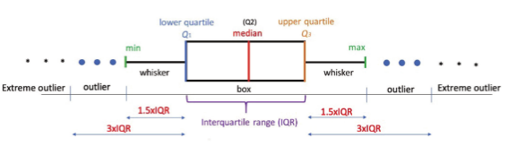

# 데이터 분석 필수지식

HIRA e-Book : [파이썬을 활용한 데이터 및 AI 분석 사례](https://www.hira.or.kr/sViewer/index.do?ebookSn=659)  
블로그 참고 : [기초 통계 (장철원)](https://losskatsu.github.io/statistics/mean-vairance/#2-1-%EB%B6%84%EC%82%B0variance)  
위키백과 참고

## 통계

### 기술통계

`기술통계(Descriptive Statistics)`는 직역하면 묘사적 통계이다. 데이터를 계량화한 수치값으로 표현한다. 평균, 최빈값, 중앙값을 구하고 분산을 구하는 것이 바로 기술통계이다.  
ex) 야구에서 투수의 방어율, 타자의 타율 등

### 추론통계

`추론통계(Inferential Statistics)`는 추리, 추정하는 통계를 말한다. 어떤 데이터를 바탕으로 가까운 미래를 예측하는 것이 목표이다. 데이터 분석의 밑바탕에는 일부를 통해 전체를 바라보는 ‘통계적 추론’이 자리하고 있다.  
ex) 선거 때 출구조사로 최종 투표결과를 빠르게 예측

## 통계량

추출된 표본 데이터를 계량한 여러 종류의 수치(값)들을 말한다. 또한, 표본을 수치 계량한 내용으로 표본의 특징을 설명해주는 기능을 한다.

| 주요 통계량 | 설명                                                                  |
| ----------- | --------------------------------------------------------------------- |
| 표본평균    | 데이터들의 중심 경향치로 산술, 조화, 기하평균 등 여러 종류가 있다.    |
| 표본분산    | 데이터 간의 퍼짐 정도를 표현하는 값 (= 데이터의 변동성을 대표하는 값) |
| 표준편차    | 평균과 데이터 간 표준 차이                                            |
| 표준오차    | 표본평균들의 표준편차 (=표준분포의 표준오차)                          |
| 표본비율    | 어떤 성질을 갖는 요소가 표본에서 차지하는 비율                        |

### 분산과 표준편차

분산은 평균의 한계를 보완할 수 있는 통계량이다. 평균은 데이터 간 분포의 차이가 뚜렷함에도 불구하고 값이 동일하게 나오기 때문에 그 차이를 설명할 수 없다.

#### 분산

`분산(Variance)`은 데이터가 얼마나 '퍼져있는지'를 표현하는 통계량이다. 또한, 데이터의 움직임(variability)을 설명할 수 있는 통계량이다.  
분산이 클수록 데이터 서로 간의 퍼짐이 크고, 작을수록 데이터 퍼짐 정도가 작다.  
평균에서 데이터 각각의 값을 빼고(편차를 구하고) 제곱하여 그 값을 모두 더한 뒤, 전체 데이터 개수에서 하나의 데이터를 뺀 값(n-1)으로 나누어 분산을 구한다. 데이터 간 거리(편차)를 구한 값이 음수인 경우 양수로 바꾸어 데이터 간 거리를 설명한다. 이때, 데이터 간 거리는 '변동성'을 설명한다. (분산을 다른 말로 '변량'으로 부르는 이유다.)  
$Sample \ Variance = S^2 = \frac{\sum (X-\bar X)^2}{n-1}$

#### 표준편차

  
(&#963;의 차이(=간격)가 모두 1인 경우를 표현하였다.)

`표준편차(Standard Deviation)`는 분산에 양의 제곱근하여 구한다.  
평균과 개별 데이터 간 차이(=편차)의 표준값이라 생각하면 쉽다. 표본의 표준편차는 보통 S(또는 시그마 &#963;)로 칭한다. 각 개별 데이터와 평균값 간 차이들의 표준값이다. 따라서 표준편차는 데이터 분포의 간격을 설명할 수 있는 대푯값의 기능을 갖는다.

##### 분산이 있는데 표준편차는 왜 필요할까?

분산에는 편차를 제곱하면서 값이 크게 증가하는 단점이 있다. 이렇게 구한 분산은 값 자체의 의미를 파악하기 어려운 경향이 있다. 따라서 표준편차에서 제곱근을 하는 것은 제곱하면서 증가했던 분산값을 다시 원래 단위로 맞추는 과정이라고 이해하면 된다.

### 사분위수

데이터를 4등분하는 위치의 수를 사분위수라 칭한다. 전체 데이터를 순위별로 4등분 하는데, 이때 등분
지점이 되는 위치의 수를 Q1, Q2, Q3라 한다.

| 사분위수        | 설명                            | 비고                    |
| --------------- | ------------------------------- | ----------------------- |
| 제1사분위수(Q1) | 누적 백분율이 25%에 해당하는 값 | 25번째 백분위수         |
| 제2사분위수(Q2) | 누적 백분율이 50%에 해당하는 값 | 50번째 백분위수, 중앙값 |
| 제3사분위수(Q3) | 누적 백분율이 75%에 해당하는 값 | 75번째 백분위수         |

#### 사분위 범위 확인

**사분위 범위(Inter-Quartile Range)를 찾는 방법**

1. 데이터를 숫자 순으로 정리
2. 데이터를 숫자가 낮은 그룹과 숫자가 높은 그룹 2개로 나누기
3. 숫자가 낮은 그룹과 높은 그룹 각각의 중앙값을 순서대로 찾기
4. $IQR = Q_3 - Q_1$

이렇게 하면 전체 데이터의 중앙값을 하나 찾게 되고 숫자가 낮은 그룹의 중앙값 하나, 높은 그룹의 중앙값 하나, 총 3개의 중앙값(경계값)을 구할 수 있게 된다. 이와 같은 방법으로 얻어낸 IQR을 통해서 우리는 데이터가 얼마나 흩어져 있는지에 대한 정도를 알 수 있다.

### IQR과 박스플롯(Box plot)

자료를 구성하는 데이터(산포)의 범위가 어느 정도인지를 IQR을 통하여 계산된 내용을 박스플롯 그래프로
시각화하여 직관적으로 파악해 볼 수 있다. 박스플롯은 Q1에서 Q3까지를 박스로 표현해주고 해당 박스에
전체 중앙값(Q2)을 실선으로 표기해 준다. 그 뿐만 아니라 극단값(outlier)까지 확인할 수 있어 데이터 분석 전에 데이터의 구성과 특징을 한눈에 이해하는 데 자주 사용되는 시각화 도구 중 하나이다.

  
데이터 산포 구성을 IQR을 기준으로 박스 처리하여 표현하며 최솟값, 최댓값, 중앙값 그리고 이상치(outlier) 등 분석에 필요한 수치값들을 일목요연하게 시각화하는 기능을 갖는다.
